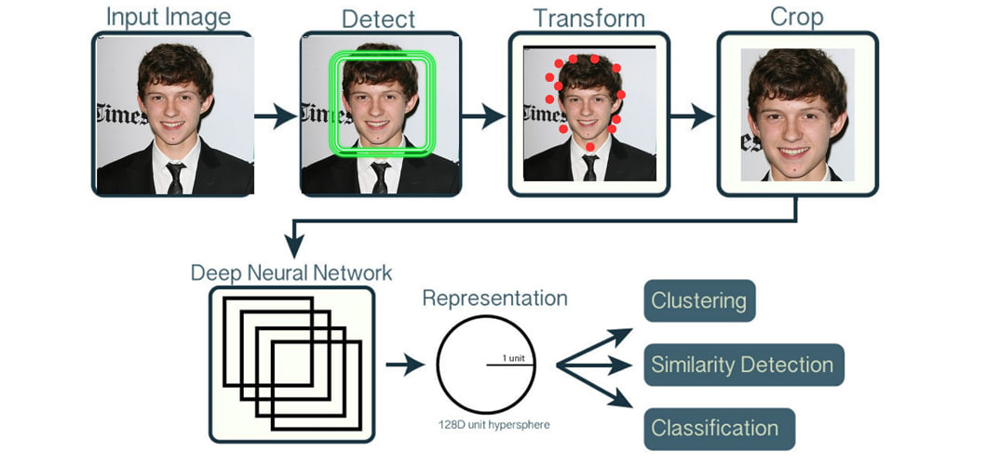
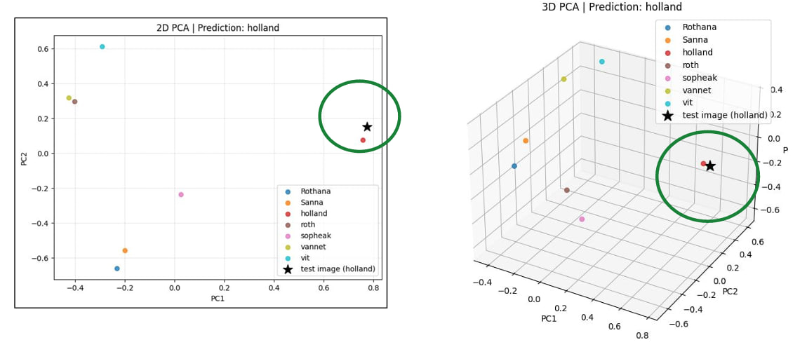
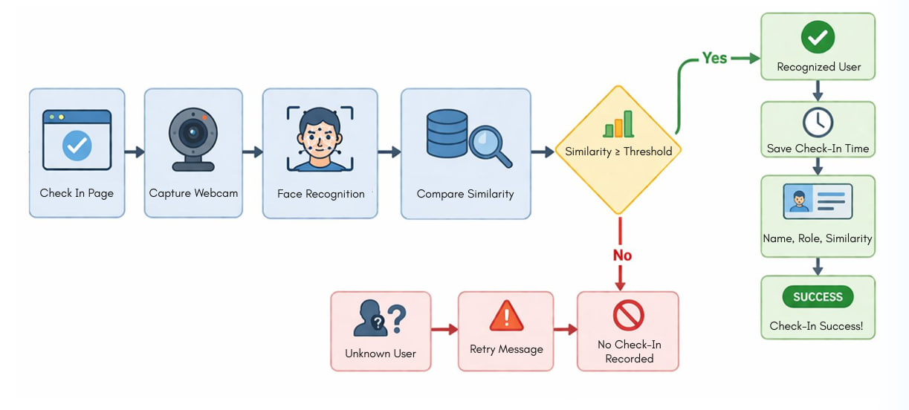

# FaceAttendance: Using InsightFace and Cosine Similarity

Traditional attendance systems are inefficient and time-consuming. There is also no real-time tracking or analytics. Our goal was to build a face-based attendance system that is fast, accurate, and requires no retraining. The workflow is simple: students register their faces once, and all subsequent check-ins are done instantly through face recognition, without any manual input. This project is developed solely for demonstration and learning purposes.


## Overview

Before diving into how the system works, it's important to understand why we chose this specific approach over simple CNN classifiers or YOLO-based detection.

A naive approach would train a model classify identities directly (e.g., "Student 1", "Student 2", etc.). This sounds straightforward but has major drawbacks:

- **Closed-set problem** : the network learns only the exact faces in training set. Enrolling a new student requires retraining the entire model
- **Scalability** : each new person added to the system requires retraining with all previous data
- **Limited generalization** : the model hasn't seen the new person's face during training, so accuracy is unpredictable.

Adding a new person would require retraining the model, which is not scalable. Instead, we use an embedding-based approach, where each face is represented as a vector and compared using similarity metrics. This allows new identities to be added without retraining the model, making the system more flexible and scalable for real-world use.

### InsightFace + Cosine Similarity

InsightFace is a pre-trained deep learning model trained on millions of faces. It converts each face into a 128-dimensional vector (or 512-dimensional vector). We can think of this as a ‘face fingerprint’. Similar faces produce similar vectors, while different faces produce very different ones.



Each dimension stores latent facial information such as facial structure, distance between eyes, shape of the nose, and other unique patterns learned by the model: `x = [x1, x2, x3, ..., x128]`

| Index | Name | Role    | Facial_Features |
|------|------|---------|-----------------|
| 0    | A    | Student | [0.1988, 1.4748, -0.0980, ...] |
| 1    | B    | Teacher | [-0.2219, 1.5761, -0.5030, ...] |
| 2    | C    | Student | [0.3568, -0.4151, 0.0392, ...] |
| 3    | D    | Teacher | [0.7628, 0.8905, 0.4687, ...] |
| 4    | E    | Student | [-0.1354, -0.2822, -0.4263, ...] |

During recognition, we compare the new embedding with all stored prototypes using cosine similarity, which measures how similar two vectors are based on the angle between them.


Where:
- a · b is the dot product of the two vectors
- ||a|| and ||b|| are the magnitudes of the vectors
- If two vectors are very similar, cosine similarity is close to 1
- If they are different, the value is closer to 0

Similar faces produce similar vectors, while different faces produce very different ones. We visualized this in [`visualization.ipynb`](visualization.ipynb) — each person's embeddings form a tight cluster, and unknown faces scatter far from all of them.



### Key Advantages

- **Open-set recognition** : new people can be added by simply computing their embedding and storing it, ,no retraining needed
- **Real-time enrollment** : students can self-enroll by capturing 5 seconds of video, their prototype is instantly available for recognition
- **Simple arithmetic** : identifying a new face is just a dot product (cosine similarity) between the test embedding and stored prototypes
- **Production-ready** : the model is pre-trained and frozen, no model updates, updates are data-only
- **Threshold-based flexibility** : adjust sensitivity by changing the similarity threshold, not retraining

---

## Registered User Check-in Flow



1. Student goes to the Check In/Out
2. Capture — the browser takes a single webcam frame
3. The frame is sent to our FastAPI service as a Base64 JPEG
4. InsightFace detects the face and extracts a 512D embedding
5. We compute cosine similarity against every stored prototype
6. If the best match is ≥ 0.60 → recognized, attendance is logged with name, role, time, and similarity score
7. If it falls below the threshold → Unknown, no record is created

---

## Tech Stack

| Layer | Technology |
|---|---|
| Frontend | React 18, Vite, Tailwind CSS |
| Backend API | FastAPI, Uvicorn |
| Face Recognition | InsightFace Buffalo_L (ONNX Runtime) |
| Data | CSV files, no database in this experiement  |
| Dev Runner | concurrently, one `npm start` launches everything |

---

## API Reference

**POST `/extract-embedding`** — pure face extraction, used during enrollment

**POST `/recognize`** — extraction + prototype matching, used during check-in

Request format:
```json
{
  "imageData": "data:image/jpeg;base64,/9j/4AAQSkZJR...",
  "threshold": 0.6
}
```

Response format:
```json
{
  "success": true,
  "embedding": [0.123, -0.456, ...],
  "det_score": 0.85,
  "person": "holland",
  "role": "student",
  "similarity": 0.75,
  "message": "Matched"
}
```

---

## Setup & Running

```bash
#  Clone the repo
git clone <https://github.com/sopheakchan/face-attend-insightface>
cd face-attend-insightface

#  Create and activate a Python virtual environment
python -m venv env

# Windows:
env\Scripts\activate
# Mac/Linux:
source env/bin/activate

# Install Python dependencies
pip install -r requirements.txt

#  Install root dependencies
npm install

# Start everything with one command
npm start
```

The app will start at **http://localhost:5173** 

> **In the first run:** InsightFace automatically downloads ~500MB of face recognition models into `.insightface/`. This is a one-time download — subsequent starts are instant.
---

## Inspiration & Resources

The following resources inspired and helped us in building this project:

- [InsightFace](https://github.com/deepinsight/insightface)
- [FaceNet paper](https://arxiv.org/abs/1503.03832)
- [Face Recognition with cosine similarity by rakibulhaque9954](https://github.com/rakibulhaque9954/face_recognition_attendance_system)
- [Face embeddings discussion](https://www.reddit.com/r/computervision/comments/1bq8olg/guidance_in_generating_better_face_embeddings_for/)
